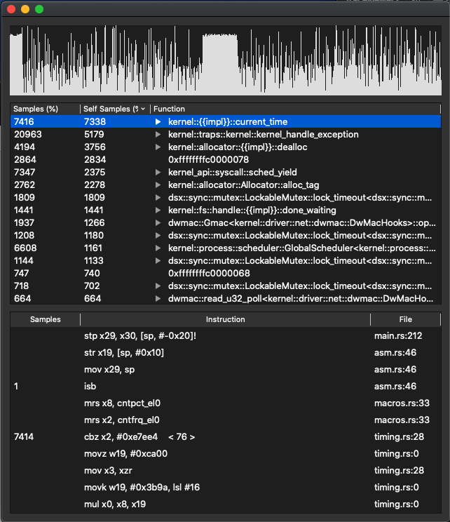

# TraceViewer

View traces saved or streamed from [rustos](https://github.com/Pear0/rustos) while symbolizing
the traces in a standard "profiling tools" interface.

This project only supports Aarch64 right now but is mostly platform agnostic.



## Build

The project requires Qt5, zlib, dwarf, elf, capstone, and capnproto.

On macOS these can be installed with homebrew using the following commands.

```shell
$ brew install qt5
$ brew install dwarfutils
$ brew install libelf
$ brew install capnp
```
